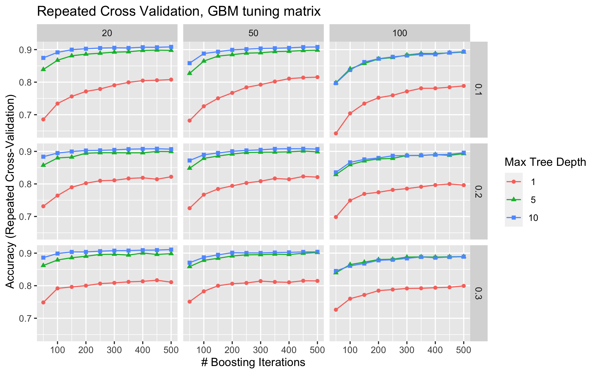
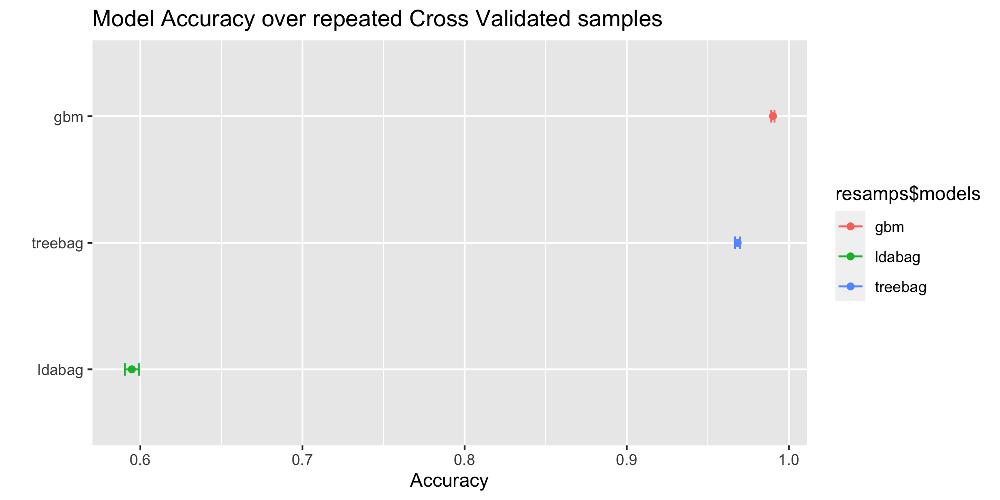
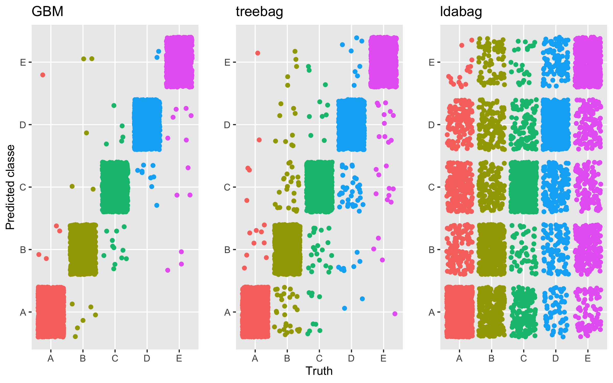

## Synopsis
Exercise is great for people, though injury and enjoyment vary with technique.  The experience may be enhanced using technology to classify technique, and a model-based classification of these techniques are the focus of this analysis.  In particular, the simple dumbbell lift provides a rich array of data and is ripe for trying out -- in this case three -- different models. 

### Exploratory Data Analysis

These are exercise-related data kindly offered by the **Human Activity Recognition** website.  From a sample of 8 indiviuals, numerous continuous measurements were taken.  The data came in the form of a comma separated file with 160 features and 19622 observations.  More details are provided [here](http://web.archive.org/web/20161224072740/http:/groupware.les.inf.puc-rio.br/har).

#### Character and Time variable reduction
Sample prints and diagnostics identified a small subset of variables that we set aside as they describe elements not included in this effort.  For example, the `user_name` variable adds a user-specific dimension if included in the models, we are trying to build a dumb classifier, independent of user.  

The usefulness of the time variables was difficult to assess, the [original paper](http://web.archive.org/web/20161224072740/http://groupware.les.inf.puc-rio.br/public/papers/2013.Velloso.QAR-WLE.pdf) goes into more detail on how these `new_window = yes` records are calculated (e.g., sliding 2.5s intervals).  The table below summarizes.


Table: **Character and Time variables removed from consideration (n=7)**

|varname              | varindex|description            |reason_removed                                              |
|:--------------------|--------:|:----------------------|:-----------------------------------------------------------|
|X1                   |        1|a sequential record id |obviously this would distort the model if left in           |
|user_name            |        2|study participant name |we want to predict classe for any person, therefore removed |
|raw_timestamp_part_1 |        3|raw timestamp part 1   |time disregarded in this analysis                           |
|raw_timestamp_part_2 |        4|raw timestamp part 2   |                                                            |
|cvtd_timestamp       |        5|converted timestamp    |                                                            |
|new_window           |        6|new_window             |used to separate 'yes' data, n=406                          |
|num_window           |        7|num_window             |an incremental window counter                               |

With relatively high dimensionality, summary functions were used to highlight characteristics.  The first aspect examined was the `new_window` variable.  This was determined to be a summarization of detail records tagged with "no", and set aside early in the code.  The remainder of this analysis focuses on the "no" data, 19216 records.

#### Highly correlated variable reduction
The `cor` function was used to identify correlations above 80%, and several (n=100) were found to be highly correlated.

As we know the nature of the measurements should include things that will correlate (there are only three dimensions being measured on a single body with a limited, intended motion), we leave some correlated covariates in the model (i.e., we don't exclude all correlated variables).  For example, an analysis of a dance movement would have more complicated relationships and a more strict reduction might be fine, here, the motion is so limited.  Below is a summary.


Table: **High Correlation variables removed from consideration (n=22, sample of 5 below)**

|varname          | varindex|high_corr_no   |
|:----------------|--------:|:--------------|
|roll_belt        |        8|corr above 0.8 |
|pitch_belt       |        9|corr above 0.8 |
|yaw_belt         |       10|corr above 0.8 |
|total_accel_belt |       11|corr above 0.8 |
|accel_belt_x     |       40|corr above 0.8 |

#### Low or near-zero variance variable reduction
In a similar fashion, the R function `nearzeroVariance` was used to identify variables that would add little additional information to our models.  This process identified several variables with zero variance, these were removed to avoid inflation of the model variance.


Table: **Near-zero Variance variables removed from consideration (n=100, sample of 5 below)**

|varname              | varindex| freqRatio| percentUnique|zeroVar |
|:--------------------|--------:|---------:|-------------:|:-------|
|kurtosis_roll_belt   |       12|         0|             0|TRUE    |
|kurtosis_picth_belt  |       13|         0|             0|TRUE    |
|kurtosis_yaw_belt    |       14|         0|             0|TRUE    |
|skewness_roll_belt   |       15|         0|             0|TRUE    |
|skewness_roll_belt.1 |       16|         0|             0|TRUE    |

#### Missing data
Finally, missing data were explored.  At this point we have
1.  only detail "no" data
2.  highly correlated and near-zero removed

We observe no missing data, a convenience as our model choices do not require any imputation of data.

#### Transformations
While the main focus has been on dimension reduction, density plots (not presented here) of remaining variables indicated heteroskedasticity.  As some were of course negative, the Yeo-Johnson transformation is applied to `preProcess` the model builds, resulting in a better fit.

#### Final data
This yields a final modeling dataset having the following characteristics...at this point the dimensionality has been thoughtfully reduced, addressing covariance, near-zero variance, and missing data realities.  

Before we traded computational speed for accuracy, in an effort to see the behavior of the model tuning features (for GBM).  Some observations:

1. Given significant dimension reduction, some hopeful results
2. Adjusting GBM models allows flexibility to react to overfitting
3. Similar variable importance (covered later)

The model building comes next, where data and cross validation are expanded.


Table: Sample Print of final dataset (raw)

|classe | gyros_belt_x| gyros_belt_y| gyros_belt_z| magnet_belt_y| magnet_belt_z|
|:------|------------:|------------:|------------:|-------------:|-------------:|
|A      |         0.00|         0.00|        -0.02|           599|          -313|
|A      |         0.02|         0.00|        -0.02|           608|          -311|
|A      |         0.00|         0.00|        -0.02|           600|          -305|
|A      |         0.02|         0.00|        -0.03|           604|          -310|
|A      |         0.02|         0.02|        -0.02|           600|          -302|


Table: Dimensions

| observations| variables|
|------------:|---------:|
|        13451|        31|


Table: Distribution of classe variable

|classe |    n|
|:------|----:|
|A      | 3780|
|B      | 2607|
|C      | 2377|
|D      | 2199|
|E      | 2488|


## Building the classification model
A *modeling process* was built to more easily explore the data.  The R package `caret` was used to create data partitions separating training data into a set to build models on, and a set to test.  These test data are used afterwards to assess our estimated out of sample error rate.  

We *explored* a smaller (10/90) random sample of the training data for the GBM model grid, and gave the faster treebag and ldabag models a more realistic 70/30 training/validation split.  

The final model comparisons are done with all settings identical (70/30 training/test, 5 times repeated resampling on 10 folds).

#### Gradient Boosting Model (GBM)


The Gradient Boosting Model was of interest -- particularly in the spirit of model tuning.  A `caret` grid of variations of model tuning features was built to generate estimates using a variety of the `gbm` tuning parameters.  This allowed for the exploration of 270 models in a convenient way (less code, obviously).

Below are the results, where one can see the increase in model performance as we adjust the required minimum in each branch of the tree (these form the columns), as well as how much information is retained for future branch development (shrinkage, forming the plot rows).  The plots themselves are of increasing accuracy, as we subject the model to more boosting iterations.  The model results are gathered and summarized, and we have a set of 270 model objects in the end.  



One observation is the matrix above suggests requiring stricter pathways has noticeably less accuracy -- that is, a minimum of 100 in each node had to be satisfied (column 3), leaving fewer choices for the model to decide `classe`.  Also the effects of shrinkage, where one observes initial Accuracy gains, controlling the learning rate.  When .1, the model "forgets" it's current mapping and has a wider set of choices to solve (higher performance).

#### Bagged, Boosted Trees (treebag)
A second model was built using `treebag`.  There are no tuning options for `treebag`.  A comparison will follow.


#### Bagged Linear Discriminate Analysis (LDA)
A third `lda` model was built as well, again there are no tuning parameters.  Next we will examine the resamples.


## Selecting the Classification Model

#### Cross Validation
Cross validation was performed using 10-folds of the training data, repeated five times.  Output below shows not only differences in Accuracy (placement on plot), but the pattern of solutions, including variance (indicated by the width).




Obviously the `ldabag` try is out of the question it's performance is little better than a guess...but we can use this cross-validation information to set expectations around the out of sample error rate.  One thing that stands out is how tight the spread is in the plot, indicating a high degree of fitting.  

#### Variable Importance
Below are output from two of our models, the GBM model does not have an analog that works in `knitr`, but results are similar.  Noteworthy is the agreement across the two lists, though in a different format, each indicates the same important variables affecting the classifications.  For example, the magnet dimensions play a huge role in these classifiers.  

From the `caret` documentation...For multi-class outcomes, the problem is decomposed into all pair-wise problems and the area under the curve is calculated for each class pair (i.e. class 1 vs. class 2, class 2 vs. class 3 etc.). For a specific class, the maximum area under the curve across the relevant pair-wise AUC’s is used as the variable importance measure.


```
treebag variable importance

  only 20 most important variables shown (out of 30)

                     Overall
magnet_dumbbell_z     100.00
gyros_belt_z           84.04
magnet_dumbbell_y      81.53
magnet_belt_y          68.83
roll_forearm           68.73
magnet_belt_z          60.93
pitch_forearm          59.84
accel_dumbbell_y       57.23
roll_dumbbell          51.83
magnet_dumbbell_x      46.60
magnet_forearm_z       41.28
roll_arm               35.54
yaw_arm                33.31
total_accel_dumbbell   31.13
gyros_dumbbell_y       29.80
accel_arm_y            26.96
pitch_arm              25.91
magnet_forearm_y       25.18
accel_forearm_x        25.06
yaw_forearm            24.50
```

```
ROC curve variable importance

  variables are sorted by maximum importance across the classes
  only 20 most important variables shown (out of 30)

                          A       B      C      D       E
pitch_forearm       61.7707 100.000 66.938 61.771 100.000
accel_forearm_x     42.1399  80.594 42.140 42.140  80.594
magnet_forearm_x    38.3199  68.920 33.952 33.952  68.920
magnet_dumbbell_y   47.7577  47.758 47.758 67.091  45.240
magnet_belt_y       14.5288   7.963 66.731  9.831  14.529
magnet_dumbbell_x   63.0164  63.016 63.016 63.016  48.771
roll_dumbbell       41.1058  50.200 31.414 62.682  50.200
magnet_dumbbell_z   54.7421  36.355 53.774 22.845  54.742
magnet_belt_z        0.7332   3.302 49.830  2.684   3.302
pitch_arm           24.7029  40.705 48.890 24.703  40.705
accel_dumbbell_y    34.7208  18.250 18.250 42.398  34.721
total_accel_arm     29.7083  39.423 31.418 14.722  39.423
magnet_forearm_y    20.3198  38.212 29.578 24.136  38.212
roll_forearm        35.7099   4.501 11.850 24.957  35.710
roll_arm            34.1398  34.140 34.140 34.140  26.047
total_accel_forearm 22.6557  24.859 31.706 22.656  24.859
accel_arm_z         27.9410  27.005 13.400 21.384  27.941
accel_forearm_y     27.2440   2.803  2.803 23.730  27.244
accel_arm_y         14.2548  17.965 21.917 15.485  17.965
yaw_forearm         10.5281  16.451 12.734 21.347  16.451
```

## Testing the models -- predicting new data
With a final model chosen (in the case of GBM), we have three models to run against the validation subset of our data.  Recall these models were built on 70% of the training data, leaving 30% as a completely fresh sample.  

<div class="figure" style="text-align: center">

<p class="caption">**Prediction versus Truth**</p>
</div>

Therefore we can see excellent performance from the GBM, a bit less for treebag, and a mere guess for the LDA.  We will select the GBM, knowing the treebag is not a bad option, and with a little more variation observed in the resampling, might do better with fresh data.

## Choices made
The analysis choices made can be summarized:

1.  variable reduction was key -- we greatly reduced the concern space
	+ high correlation
	+ near zero variance
2.  LDA option was not good in this case
3.  low variance in the resampling indicates probable overfitting

## Summary
In conclusion, the discussion here leads us to further questions, as usual and a good thing.  First, we might consult the engineering experts and design simplified measures revolving around the tighter, core set we classify with.  Second, these data are for less than ten people, so generalizing (and exploring generalizing models) might be a challenge.  Finally, a new appreciation for budding, open-source technologies and model build complexities was valuable.

### Citations
The data used in this analysis were graciously provided by the **Human Activity Recognition** website, which can be accesed [here](http://web.archive.org/web/20161224072740/http:/groupware.les.inf.puc-rio.br/har). Thank you HAR!

## System Information
This work was developed on the following system, using `R.version.string`:

      Model Name: iMac
      Processor Name: Quad-Core Intel Core i7
      Memory: 32 GB

The following R libraries were utilized:

`library(tidyverse)`
`library(rattle)`
`library(Hmisc)`
`library(corrgram)`
`library(caret)`
`library(gridExtra)`
`library(adabag)`
`library(fastAdaboost)`
`library(rlist)`
`library(stringi)`

# Code Appendix
# quiet load libraries
suppressPackageStartupMessages(library(tidyverse))
suppressPackageStartupMessages(library(rattle))
suppressPackageStartupMessages(library(Hmisc))
suppressPackageStartupMessages(library(corrgram))
suppressPackageStartupMessages(library(caret))
suppressPackageStartupMessages(library(gridExtra))
suppressPackageStartupMessages(library(adabag))
suppressPackageStartupMessages(library(fastAdaboost))
suppressPackageStartupMessages(library(rlist))
suppressPackageStartupMessages(library(stringi))

high_correlation_cutoff_no<-.8
high_correlation_cutoff_yes<-.8

original_training<-data.frame(read_csv("pml-training.csv", na=c("NA", "#DIV/0!")), stringsAsFactors = F)
TESTING<-data.frame(read_csv("pml-testing.csv", na=c("NA", "#DIV/0!")), stringsAsFactors = F)
TESTING
########################################
TESTING_net_new<-data.frame(read_csv("WearableComputing_weight_lifting_exercises_biceps_curl_variations.csv", na=c("NA", "#DIV/0!")), stringsAsFactors = F)

names(TESTING_net_new)[which(!names(TESTING_net_new) %in% names(original_training))]
names(original_training)[which(!names(original_training) %in% names(TESTING_net_new))]
TESTING_net_new<-setdiff(TESTING_net_new[,-15],original_training[,-c(1,16)])

head(TESTING_net_new[1:10,1:10])
########################################


#TESTING<-data.frame(read_csv("pml-testing.csv", na=c("NA", "#DIV/0!")), stringsAsFactors = F)
dim(original_training)
names(original_training)
str(original_training[,1:10])
varmap_original<-data.frame(
	varname=colnames(original_training),
	varindex=c(1:length(colnames(original_training))), stringsAsFactors = F)
vartypes<-data.frame(typex=sapply(original_training, typeof), varname=colnames(original_training), stringsAsFactors = F)
varmap_original<-left_join(varmap_original, vartypes)
dim(original_training)

# split off junk variables, but have them avaialable as needed...
junk_frame<-select(original_training, user_name, cvtd_timestamp, new_window, X1, raw_timestamp_part_1, raw_timestamp_part_2, num_window)
head(junk_frame)

# remove the summary records here, maybe deal with later (new_window=="yes")
training_new_window_no<-filter(original_training, new_window=="no")%>%select(-c(user_name, cvtd_timestamp, X1, raw_timestamp_part_1, raw_timestamp_part_2, num_window, new_window))
training_new_window_yes<-filter(original_training, new_window=="yes")%>%select(-c(user_name, cvtd_timestamp, X1, raw_timestamp_part_1, raw_timestamp_part_2, num_window, new_window))
head(training_new_window_no[1:10,1:10])
head(training_new_window_yes[1:10,1:10])

# reorder columns, character variables up front for easier subsetting
df_charvars_check<-data.frame(sapply(names(training_new_window_no), function(x){is.character(training_new_window_no[,x])}))
newvarlist<-c(which(df_charvars_check>0),which(df_charvars_check<1))
training_new_window_no<-training_new_window_no[,newvarlist]
str(training_new_window_no[,1:10])
dim(training_new_window_no)

df_charvars_check<-data.frame(sapply(names(training_new_window_yes), function(x){is.character(training_new_window_yes[,x])}))
newvarlist<-c(which(df_charvars_check>0),which(df_charvars_check<1))
training_new_window_yes<-training_new_window_yes[,newvarlist]
dim(training_new_window_yes)
head(training_new_window_yes[1:10,1:10])

# identify very low variance variables
nzv_no<-data.frame(nearZeroVar(training_new_window_no, saveMetrics = T), varname=names(training_new_window_no), nzv_no=rep("no", length(names(training_new_window_no))), stringsAsFactors = F)%>%filter(zeroVar==TRUE & near(percentUnique,0))
dim(nzv_no)
nzv_yes<-data.frame(nearZeroVar(training_new_window_yes, saveMetrics = T), varname=names(training_new_window_yes), nzv_yes=rep("yes", length(names(training_new_window_yes))), stringsAsFactors = F)%>%filter(zeroVar==TRUE & near(percentUnique,0))
dim(nzv_yes)

(lst_nzv_reductions_no<-which(names(training_new_window_no) %in% as.list(nzv_no$name)))
(lst_nzv_reductions_yes<-which(names(training_new_window_yes) %in% as.list(nzv_yes$name)))

# identify high correlation variables, will remove later, adjust cutoff
corr_matrix<-abs(cor(training_new_window_no[,-1]))
diag(corr_matrix)<-0
high_corr_no<-unique(names(which(corr_matrix>high_correlation_cutoff_no, arr.ind = T)[,1]))
(lst_high_corr_no<-which(names(training_new_window_no) %in% high_corr_no))
corr_matrix_no<-corr_matrix

corr_matrix<-abs(cor(training_new_window_yes[,-1]))
diag(corr_matrix)<-0
high_corr_yes<-unique(names(which(corr_matrix>high_correlation_cutoff_yes, arr.ind = T)[,1]))
(lst_high_corr_yes<-which(names(training_new_window_yes) %in% high_corr_yes))


######### NEED TO DISTINGUISH YES NO VERSIONS OF DROPS IN VARMAP...!!!!!!!!!!!!!!!!!!!!!!!
nrow(nzv_yes)-nrow(inner_join(nzv_no, nzv_yes, by = c("freqRatio", "percentUnique", "zeroVar", "nzv", "varname")))
varmap<-left_join(varmap_original, data.frame(varname=names(junk_frame), source1="junk both", junk_status="junk"))%>%
	left_join(data.frame(varname=high_corr_no, high_corr_no=str_c("corr above ", high_correlation_cutoff_no)))%>%
	left_join(data.frame(varname=high_corr_yes, high_corr_yes=str_c("corr above ", high_correlation_cutoff_yes)))%>%
	left_join(nzv_no)%>%left_join(nzv_yes)
head(varmap,30)

clean_no<-which(names(training_new_window_no) %in% as.list(filter(varmap, is.na(junk_status)==T & is.na(nzv_no)==T & is.na(high_corr_no)==T))$varname)
clean_yes<-which(names(training_new_window_yes) %in% as.list(filter(varmap, is.na(junk_status)==T & is.na(nzv_yes)==T & is.na(high_corr_yes)==T))$varname)

no_final<-training_new_window_no[,clean_no]
head(no_final)
yes_final<-training_new_window_yes[,clean_yes]
head(yes_final)

# identify missing values
length(which(sapply(names(no_final), function(x) sum(is.na(no_final[,x]))>0)))
length(which(sapply(names(yes_final), function(x) sum(is.na(yes_final[,x]))>0)))

# update varmap
tmp<-data.frame(count_missing_no=sapply(names(no_final), function(x) sum(is.na(no_final[,x]))))
varmap<-left_join(varmap, data.frame(varname=rownames(tmp), tmp), by = "varname")
tmp<-data.frame(count_missing_yes=sapply(names(yes_final), function(x) sum(is.na(yes_final[,x]))))
varmap<-left_join(varmap, data.frame(varname=rownames(tmp), tmp), by = "varname")

TESTING<-data.frame(read_csv("pml-testing.csv", na=c("NA", "#DIV/0!")), stringsAsFactors = F)
TESTING
str(TESTING)
########################################
TESTING_net_new<-data.frame(read_csv("WearableComputing_weight_lifting_exercises_biceps_curl_variations.csv", na=c("NA", "#DIV/0!")), stringsAsFactors = F)
str(TESTING_net_new)
# names(TESTING_net_new)
# names(TESTING)
names(TESTING_net_new)[15]<-"skewness_roll_belt.1"
names(TESTING_net_new)[which(!names(TESTING_net_new) %in% names(TESTING))]
names(original_training)[which(!names(original_training) %in% names(TESTING_net_new))]
TESTING_net_new<-setdiff(TESTING_net_new[,-15],original_training[,-c(1,16)])
nrow(inner_join(original_training, TESTING_net_new))
#head(TESTING_net_new[1:10,1:10])

TESTING<-filter(TESTING, new_window=="no")%>%select(-c(user_name, cvtd_timestamp, X1, raw_timestamp_part_1, raw_timestamp_part_2, num_window, new_window))
TESTING_net_new<-filter(TESTING_net_new, new_window=="no")%>%select(-c(user_name, cvtd_timestamp, raw_timestamp_part_1, raw_timestamp_part_2, num_window, new_window))

#clean_no<-which(names(training_new_window_no) %in% as.list(filter(varmap, is.na(junk_status)==T & is.na(nzv_no)==T & is.na(high_corr_no)==T))$varname)
clean_no_TESTING<-which(names(TESTING) %in% as.list(filter(varmap, is.na(nzv_no)==T & is.na(high_corr_no)==T))$varname)
clean_no_TESTING_net_new<-which(names(TESTING_net_new) %in% as.list(filter(varmap, is.na(nzv_no)==T & is.na(high_corr_no)==T))$varname)

TESTING_net_new<-TESTING_net_new[,clean_no_TESTING_net_new]
TESTING<-TESTING[,clean_no_TESTING]

dim(TESTING_net_new)
dim(TESTING)

head(TESTING[1:10,1:10])
head(TESTING_net_new[1:10,1:10])
#nrow(filter(varmap, is.na(nzv_no)==F))

junk_drops<-data.frame(
varmap[1:7, 1:2], 
description=c(
	"a sequential record id",
	"study participant name",
	"raw timestamp part 1", 
	"raw timestamp part 2", 
	"converted timestamp",
	"new_window",
	"num_window"), 
reason_removed=c(
"obviously this would distort the model if left in", 
"we want to predict classe for any person, therefore removed",
"time disregarded in this analysis",
"",
"",
"used to separate 'yes' data, n=406",
"an incremental window counter"))

#############################################################################################################
testrun_portion1<-.1
testrun_foldsx1<-4
testrun_repeatsx1<-2
testrun_portion2<-.1
testrun_foldsx2<-2
testrun_repeatsx2<-2
testrun_portion3<-.1
testrun_foldsx3<-2
testrun_repeatsx3<-2

final_portion<-.7
final_foldsx<-10
final_repeatsx<-5
#############################################################################################################

cluster <- makeCluster(detectCores() - 1) # convention to leave 1 core for OS
registerDoParallel(cluster)

set.seed(123)

main<-no_final

impute_methodx<-c("center","scale","YeoJohnson")

(basex<-nrow(main))
samplex<-sample(basex, floor(testrun_portion1*basex))
dfx<-main[samplex,]

impute<-preProcess(dfx[,-1], method = impute_methodx, allowParallel=T)
preprocessed<-predict(impute, dfx[,-1])

gbmGrid<-expand.grid(interaction.depth = c(1, 5, 10),
                        n.trees = (1:10)*50,
                        shrinkage = c(0.1, 0.2, .3),
                        n.minobsinnode = c(20, 50,100))
nrow(gbmGrid)
head(gbmGrid)

fitControl<-trainControl(method = "repeatedcv", number = testrun_foldsx1, repeats = testrun_repeatsx1, allowParallel = T)

set.seed(825)

gbmFit_dotx <- train(y=dfx$classe, x = preprocessed,
                 method = "gbm",
                 trControl = fitControl,
                 verbose = FALSE,
                 tuneGrid = gbmGrid)

pred_dfx<-data.frame(ground_truth=dfx$classe, prediction=predict(gbmFit_dotx,preprocessed))
confusionMatrix(pred_dfx$prediction, pred_dfx$ground_truth)

freshy<-main[-samplex,]
preprocessed_freshy<-predict(impute, freshy[,-1])
pred_freshy<-data.frame(ground_truth=freshy$classe, prediction=predict(gbmFit_dotx,preprocessed_freshy))
confusionMatrix(pred_freshy$prediction, pred_freshy$ground_truth)

preprocessed_TESTING_net_new<-predict(impute, TESTING_net_new[,-31])
pred_TESTING_net_new<-data.frame(ground_truth=TESTING_net_new$classe, prediction=predict(gbmFit_dotx,preprocessed_TESTING_net_new))
confusionMatrix(pred_TESTING_net_new$prediction, pred_TESTING_net_new$ground_truth)

stopCluster(cluster)
registerDoSEQ()

best_within_1pct<-cbind(tolerance="within 1 pct", gbmFit_dotx$results[tolerance(gbmFit_dotx$results, metric = "Accuracy", tol = 1, maximize = TRUE),1:6])
best_within_2pct<-cbind(tolerance="within 2 pct", gbmFit_dotx$results[tolerance(gbmFit_dotx$results, metric = "Accuracy", tol = 2, maximize = TRUE),1:6])
best_within_3pct<-cbind(tolerance="within 3 pct", gbmFit_dotx$results[tolerance(gbmFit_dotx$results, metric = "Accuracy", tol = 3, maximize = TRUE),1:6])
best_within_4pct<-cbind(tolerance="within 4 pct", gbmFit_dotx$results[tolerance(gbmFit_dotx$results, metric = "Accuracy", tol = 4, maximize = TRUE),1:6])
best_within_5pct<-cbind(tolerance="within 5 pct", gbmFit_dotx$results[tolerance(gbmFit_dotx$results, metric = "Accuracy", tol = 5, maximize = TRUE),1:6])

(best_alternative_models<-rbind(best_within_1pct, best_within_2pct, best_within_3pct, best_within_4pct, best_within_5pct))

##########################################
# check the real stuff...
temptesting<-data.frame(read_csv("pml-testing.csv", na=c("NA", "#DIV/0!")), stringsAsFactors = F)
tempreal<-data.frame(read_csv("WearableComputing_weight_lifting_exercises_biceps_curl_variations.csv", na=c("NA", "#DIV/0!")), stringsAsFactors = F)
t<-temptesting%>%select(user_name, raw_timestamp_part_1, raw_timestamp_part_2, gyros_belt_x, gyros_belt_y)
j<-predict(impute, TESTING)
p<-predict(gbmFit_dotx, j)
combo<-data.frame(cbind(t,p))
(r<-tempreal%>%select(user_name, raw_timestamp_part_1, raw_timestamp_part_2, gyros_belt_x, gyros_belt_y, classe)%>%inner_join(combo)%>%mutate(good=classe==p))
##########################################
nrow(dfx)
round(confusionMatrix(pred_dfx$prediction, pred_dfx$ground_truth)$overall,3)
nrow(freshy)
round(confusionMatrix(pred_freshy$prediction, pred_freshy$ground_truth)$overall,3)
nrow(TESTING_net_new)
round(confusionMatrix(pred_TESTING_net_new$prediction, pred_TESTING_net_new$ground_truth)$overall,3)
nrow(r)
sum(r$good/20)

ggplot(gbmFit_dotx, main="gbmFit_dotx")+ggtitle("Repeated Cross Validation, GBM tuning matrix")

suppressPackageStartupMessages(library(doParallel))
cluster <- makeCluster(detectCores() - 1) # convention to leave 1 core for OS
registerDoParallel(cluster)

set.seed(123)

main<-no_final

impute_methodx<-c("center","scale","YeoJohnson")

(basex<-nrow(main))
samplex<-sample(basex, floor(testrun_portion2*basex))
dfx<-main[samplex,]

system.time(impute<-preProcess(dfx[,-1], method = impute_methodx, allowParallel=T))
preprocessed<-predict(impute, dfx[,-1])

fitControl<-trainControl(method = "repeatedcv", number = testrun_foldsx2, repeats = testrun_repeatsx2, allowParallel = T)

set.seed(825)

treebagFit_dotx <- train(y=dfx$classe, x = preprocessed,
                 method = "treebag",
                 trControl = fitControl,
                 verbose = FALSE)

pred_dfx<-data.frame(ground_truth=dfx$classe, prediction=predict(treebagFit_dotx,preprocessed))
confusionMatrix(pred_dfx$prediction, pred_dfx$ground_truth)

freshy<-main[-samplex,]
preprocessed_freshy<-predict(impute, freshy[,-1])
pred_freshy<-data.frame(ground_truth=freshy$classe, prediction=predict(treebagFit_dotx,preprocessed_freshy))
confusionMatrix(pred_freshy$prediction, pred_freshy$ground_truth)

TESTING_net_newx<-TESTING_net_new%>%mutate(roll_dumbbell=ifelse(is.na(roll_dumbbell)==T, mean(TESTING_net_new$roll_dumbbell, na.rm = T), roll_dumbbell))
preprocessed_TESTING_net_newx<-predict(impute, TESTING_net_newx[,-31])
pred_TESTING_net_newx<-data.frame(ground_truth=TESTING_net_newx$classe, prediction=predict(treebagFit_dotx,preprocessed_TESTING_net_newx))
confusionMatrix(pred_TESTING_net_newx$prediction, pred_TESTING_net_newx$ground_truth)

stopCluster(cluster)
registerDoSEQ()

##########################################
# check the real stuff...
temptesting<-data.frame(read_csv("pml-testing.csv", na=c("NA", "#DIV/0!")), stringsAsFactors = F)
tempreal<-data.frame(read_csv("WearableComputing_weight_lifting_exercises_biceps_curl_variations.csv", na=c("NA", "#DIV/0!")), stringsAsFactors = F)
t<-temptesting%>%select(user_name, raw_timestamp_part_1, raw_timestamp_part_2, gyros_belt_x, gyros_belt_y)
j<-predict(impute, TESTING)
p<-predict(treebagFit_dotx, j)
combo<-data.frame(cbind(t,p))
(r<-tempreal%>%select(user_name, raw_timestamp_part_1, raw_timestamp_part_2, gyros_belt_x, gyros_belt_y, classe)%>%inner_join(combo)%>%mutate(good=classe==p))
##########################################
nrow(dfx)
round(confusionMatrix(pred_dfx$prediction, pred_dfx$ground_truth)$overall,3)
nrow(freshy)
round(confusionMatrix(pred_freshy$prediction, pred_freshy$ground_truth)$overall,3)
nrow(TESTING_net_newx)
nrow(TESTING_net_new)
round(confusionMatrix(pred_TESTING_net_newx$prediction, pred_TESTING_net_newx$ground_truth)$overall,3)
nrow(r)
sum(r$good/20)

suppressPackageStartupMessages(library(doParallel))
cluster <- makeCluster(detectCores() - 1) # convention to leave 1 core for OS
registerDoParallel(cluster)

set.seed(123)

main<-no_final

impute_methodx<-c("center","scale","YeoJohnson")

(basex<-nrow(main))
samplex<-sample(basex, floor(testrun_portion3*basex))
dfx<-main[samplex,]

system.time(impute<-preProcess(dfx[,-1], method = impute_methodx, allowParallel=T))
preprocessed<-predict(impute, dfx[,-1])

fitControl<-trainControl(method = "repeatedcv", number = testrun_foldsx3, repeats = testrun_repeatsx3, allowParallel = T)

set.seed(825)

ldaFit_dotx <- train(y=dfx$classe, x = preprocessed,
                 method = "lda",
                 trControl = fitControl,
                 verbose = FALSE)

pred_dfx<-data.frame(ground_truth=dfx$classe, prediction=predict(ldaFit_dotx,preprocessed))
confusionMatrix(pred_dfx$prediction, pred_dfx$ground_truth)

freshy<-main[-samplex,]
preprocessed_freshy<-predict(impute, freshy[,-1])
pred_freshy<-data.frame(ground_truth=freshy$classe, prediction=predict(ldaFit_dotx,preprocessed_freshy))
confusionMatrix(pred_freshy$prediction, pred_freshy$ground_truth)

TESTING_net_newx<-TESTING_net_new%>%mutate(roll_dumbbell=ifelse(is.na(roll_dumbbell)==T, mean(TESTING_net_new$roll_dumbbell, na.rm = T), roll_dumbbell))
preprocessed_TESTING_net_newx<-predict(impute, TESTING_net_newx[,-31])
pred_TESTING_net_newx<-data.frame(ground_truth=TESTING_net_newx$classe, prediction=predict(ldaFit_dotx,preprocessed_TESTING_net_newx))
confusionMatrix(pred_TESTING_net_newx$prediction, pred_TESTING_net_newx$ground_truth)

stopCluster(cluster)
registerDoSEQ()

##########################################
# check the real stuff...
temptesting<-data.frame(read_csv("pml-testing.csv", na=c("NA", "#DIV/0!")), stringsAsFactors = F)
tempreal<-data.frame(read_csv("WearableComputing_weight_lifting_exercises_biceps_curl_variations.csv", na=c("NA", "#DIV/0!")), stringsAsFactors = F)
t<-temptesting%>%select(user_name, raw_timestamp_part_1, raw_timestamp_part_2, gyros_belt_x, gyros_belt_y)
j<-predict(impute, TESTING)
p<-predict(ldaFit_dotx, j)
combo<-data.frame(cbind(t,p))
(r<-tempreal%>%select(user_name, raw_timestamp_part_1, raw_timestamp_part_2, gyros_belt_x, gyros_belt_y, classe)%>%inner_join(combo)%>%mutate(good=classe==p))
##########################################
nrow(dfx)
round(confusionMatrix(pred_dfx$prediction, pred_dfx$ground_truth)$overall,3)
nrow(freshy)
round(confusionMatrix(pred_freshy$prediction, pred_freshy$ground_truth)$overall,3)
nrow(TESTING_net_newx)
nrow(TESTING_net_new)
round(confusionMatrix(pred_TESTING_net_newx$prediction, pred_TESTING_net_newx$ground_truth)$overall,3)
nrow(r)
sum(r$good/20)

suppressPackageStartupMessages(library(doParallel))
cluster <- makeCluster(detectCores() - 1) # convention to leave 1 core for OS
registerDoParallel(cluster)

set.seed(123)

choice<-2
use_best<-"yes"

best_within_1pct<-cbind(tolerance="within 1 pct", gbmFit_dotx$results[tolerance(gbmFit_dotx$results, metric = "Accuracy", tol = 1, maximize = TRUE),1:6])
best_within_2pct<-cbind(tolerance="within 2 pct", gbmFit_dotx$results[tolerance(gbmFit_dotx$results, metric = "Accuracy", tol = 2, maximize = TRUE),1:6])
best_within_3pct<-cbind(tolerance="within 3 pct", gbmFit_dotx$results[tolerance(gbmFit_dotx$results, metric = "Accuracy", tol = 3, maximize = TRUE),1:6])
best_within_4pct<-cbind(tolerance="within 4 pct", gbmFit_dotx$results[tolerance(gbmFit_dotx$results, metric = "Accuracy", tol = 4, maximize = TRUE),1:6])
best_within_5pct<-cbind(tolerance="within 5 pct", gbmFit_dotx$results[tolerance(gbmFit_dotx$results, metric = "Accuracy", tol = 5, maximize = TRUE),1:6])

(best_alternative_models<-rbind(best_within_1pct, best_within_2pct, best_within_3pct, best_within_4pct, best_within_5pct))

(shrinkagex<-best_alternative_models[choice,2])
(interactiondepthx<-best_alternative_models[choice,3])
(nminobsinnodex<-best_alternative_models[choice,4])
(ntreesx<-best_alternative_models[choice,5])

if(use_best=="yes") (shrinkagex<-gbmFit_dotx$results[best(gbmFit_dotx$results, "Accuracy", maximize = T),1])
if(use_best=="yes") (interactiondepthx<-gbmFit_dotx$results[best(gbmFit_dotx$results, "Accuracy", maximize = T),2])
if(use_best=="yes") (nminobsinnodex<-gbmFit_dotx$results[best(gbmFit_dotx$results, "Accuracy", maximize = T),3]);
if(use_best=="yes") (ntreesx<-gbmFit_dotx$results[best(gbmFit_dotx$results, "Accuracy", maximize = T),4])

main<-no_final

impute_methodx<-c("center","scale","YeoJohnson")

(basex<-nrow(main))
samplex<-sample(basex, floor(final_portion*basex))
dfx<-main[samplex,]

system.time(impute<-preProcess(dfx[,-1], method = impute_methodx, allowParallel=T))
preprocessed<-predict(impute, dfx[,-1])

gbmGrid<-expand.grid(interaction.depth = interactiondepthx,
                        n.trees = ntreesx,
                        shrinkage = shrinkagex,
                        n.minobsinnode = nminobsinnodex)
nrow(gbmGrid)
head(gbmGrid)

fitControl<-trainControl(method = "repeatedcv", number = final_foldsx, repeats = final_repeatsx, allowParallel = T)

set.seed(825)

gbmFit_dotxfinal <- train(y=dfx$classe, x = preprocessed,
                 method = "gbm",
                 trControl = fitControl,
                 verbose = FALSE,
                 tuneGrid = gbmGrid)

pred_dfx<-data.frame(ground_truth=dfx$classe, prediction=predict(gbmFit_dotxfinal,preprocessed))
confusionMatrix(pred_dfx$prediction, pred_dfx$ground_truth)

freshy<-main[-samplex,]
preprocessed_freshy<-predict(impute, freshy[,-1])
pred_freshy<-data.frame(ground_truth=freshy$classe, prediction=predict(gbmFit_dotxfinal,preprocessed_freshy))
confusionMatrix(pred_freshy$prediction, pred_freshy$ground_truth)

preprocessed_TESTING_net_new<-predict(impute, TESTING_net_new[,-31])
pred_TESTING_net_new<-data.frame(ground_truth=TESTING_net_new$classe, prediction=predict(gbmFit_dotxfinal,preprocessed_TESTING_net_new))
confusionMatrix(pred_TESTING_net_new$prediction, pred_TESTING_net_new$ground_truth)

# special, store this models freshy
freshy_gbm<-freshy
impute_gbm<-impute

stopCluster(cluster)
registerDoSEQ()

##########################################
# check the real stuff...
temptesting<-data.frame(read_csv("pml-testing.csv", na=c("NA", "#DIV/0!")), stringsAsFactors = F)
tempreal<-data.frame(read_csv("WearableComputing_weight_lifting_exercises_biceps_curl_variations.csv", na=c("NA", "#DIV/0!")), stringsAsFactors = F)
t<-temptesting%>%select(user_name, raw_timestamp_part_1, raw_timestamp_part_2, gyros_belt_x, gyros_belt_y)
j<-predict(impute, TESTING)
p<-predict(gbmFit_dotxfinal, j)
combo<-data.frame(cbind(t,p))
(r<-tempreal%>%select(user_name, raw_timestamp_part_1, raw_timestamp_part_2, gyros_belt_x, gyros_belt_y, classe)%>%inner_join(combo)%>%mutate(good=classe==p))
##########################################
nrow(dfx)
round(confusionMatrix(pred_dfx$prediction, pred_dfx$ground_truth)$overall,3)
nrow(freshy)
round(confusionMatrix(pred_freshy$prediction, pred_freshy$ground_truth)$overall,3)
nrow(TESTING_net_new)
round(confusionMatrix(pred_TESTING_net_new$prediction, pred_TESTING_net_new$ground_truth)$overall,3)
nrow(r)
sum(r$good/20)

suppressPackageStartupMessages(library(doParallel))
cluster <- makeCluster(detectCores() - 1) # convention to leave 1 core for OS
registerDoParallel(cluster)

set.seed(123)

main<-no_final

impute_methodx<-c("center","scale","YeoJohnson")

(basex<-nrow(main))
samplex<-sample(basex, floor(final_portion*basex))
dfx<-main[samplex,]

system.time(impute<-preProcess(dfx[,-1], method = impute_methodx, allowParallel=T))
preprocessed<-predict(impute, dfx[,-1])

fitControl<-trainControl(method = "repeatedcv", number = final_foldsx, repeats = final_repeatsx, allowParallel = T)

set.seed(825)

treebagFit_dotxfinal <- train(y=dfx$classe, x = preprocessed,
                 method = "treebag",
                 trControl = fitControl,
                 verbose = FALSE)

pred_dfx<-data.frame(ground_truth=dfx$classe, prediction=predict(treebagFit_dotxfinal,preprocessed))
confusionMatrix(pred_dfx$prediction, pred_dfx$ground_truth)

freshy<-main[-samplex,]
preprocessed_freshy<-predict(impute, freshy[,-1])
pred_freshy<-data.frame(ground_truth=freshy$classe, prediction=predict(treebagFit_dotxfinal,preprocessed_freshy))
confusionMatrix(pred_freshy$prediction, pred_freshy$ground_truth)

TESTING_net_newx<-TESTING_net_new%>%mutate(roll_dumbbell=ifelse(is.na(roll_dumbbell)==T, mean(TESTING_net_new$roll_dumbbell, na.rm = T), roll_dumbbell))
preprocessed_TESTING_net_newx<-predict(impute, TESTING_net_newx[,-31])
pred_TESTING_net_newx<-data.frame(ground_truth=TESTING_net_newx$classe, prediction=predict(treebagFit_dotxfinal,preprocessed_TESTING_net_newx))
confusionMatrix(pred_TESTING_net_newx$prediction, pred_TESTING_net_newx$ground_truth)

# special, store this models freshy
freshy_treebag<-freshy
impute_treebag<-impute

stopCluster(cluster)
registerDoSEQ()

##########################################
# check the real stuff...
temptesting<-data.frame(read_csv("pml-testing.csv", na=c("NA", "#DIV/0!")), stringsAsFactors = F)
tempreal<-data.frame(read_csv("WearableComputing_weight_lifting_exercises_biceps_curl_variations.csv", na=c("NA", "#DIV/0!")), stringsAsFactors = F)
t<-temptesting%>%select(user_name, raw_timestamp_part_1, raw_timestamp_part_2, gyros_belt_x, gyros_belt_y)
j<-predict(impute, TESTING)
p<-predict(treebagFit_dotxfinal, j)
combo<-data.frame(cbind(t,p))
(r<-tempreal%>%select(user_name, raw_timestamp_part_1, raw_timestamp_part_2, gyros_belt_x, gyros_belt_y, classe)%>%inner_join(combo)%>%mutate(good=classe==p))
##########################################
nrow(dfx)
round(confusionMatrix(pred_dfx$prediction, pred_dfx$ground_truth)$overall,3)
nrow(freshy)
round(confusionMatrix(pred_freshy$prediction, pred_freshy$ground_truth)$overall,3)
nrow(TESTING_net_newx)
nrow(TESTING_net_new)
round(confusionMatrix(pred_TESTING_net_newx$prediction, pred_TESTING_net_newx$ground_truth)$overall,3)
nrow(r)
sum(r$good/20)

suppressPackageStartupMessages(library(doParallel))
cluster <- makeCluster(detectCores() - 1) # convention to leave 1 core for OS
registerDoParallel(cluster)

set.seed(123)

main<-no_final

impute_methodx<-c("center","scale","YeoJohnson")

(basex<-nrow(main))
samplex<-sample(basex, floor(final_portion*basex))
dfx<-main[samplex,]

system.time(impute<-preProcess(dfx[,-1], method = impute_methodx, allowParallel=T))
preprocessed<-predict(impute, dfx[,-1])

fitControl<-trainControl(method = "repeatedcv", number = final_foldsx, repeats = final_repeatsx, allowParallel = T)

set.seed(825)

ldaFit_dotxfinal <- train(y=dfx$classe, x = preprocessed,
                 method = "lda",
                 trControl = fitControl,
                 verbose = FALSE)

pred_dfx<-data.frame(ground_truth=dfx$classe, prediction=predict(ldaFit_dotxfinal,preprocessed))
confusionMatrix(pred_dfx$prediction, pred_dfx$ground_truth)

freshy<-main[-samplex,]
preprocessed_freshy<-predict(impute, freshy[,-1])
pred_freshy<-data.frame(ground_truth=freshy$classe, prediction=predict(ldaFit_dotxfinal,preprocessed_freshy))
confusionMatrix(pred_freshy$prediction, pred_freshy$ground_truth)

TESTING_net_newx<-TESTING_net_new%>%mutate(roll_dumbbell=ifelse(is.na(roll_dumbbell)==T, mean(TESTING_net_new$roll_dumbbell, na.rm = T), roll_dumbbell))
preprocessed_TESTING_net_newx<-predict(impute, TESTING_net_newx[,-31])
pred_TESTING_net_newx<-data.frame(ground_truth=TESTING_net_newx$classe, prediction=predict(ldaFit_dotxfinal,preprocessed_TESTING_net_newx))
confusionMatrix(pred_TESTING_net_newx$prediction, pred_TESTING_net_newx$ground_truth)

# special, store this models freshy
freshy_lda<-freshy
impute_lda<-impute

stopCluster(cluster)
registerDoSEQ()

##########################################
# check the real stuff...
temptesting<-data.frame(read_csv("pml-testing.csv", na=c("NA", "#DIV/0!")), stringsAsFactors = F)
tempreal<-data.frame(read_csv("WearableComputing_weight_lifting_exercises_biceps_curl_variations.csv", na=c("NA", "#DIV/0!")), stringsAsFactors = F)
t<-temptesting%>%select(user_name, raw_timestamp_part_1, raw_timestamp_part_2, gyros_belt_x, gyros_belt_y)
j<-predict(impute, TESTING)
p<-predict(ldaFit_dotx, j)
combo<-data.frame(cbind(t,p))
(r<-tempreal%>%select(user_name, raw_timestamp_part_1, raw_timestamp_part_2, gyros_belt_x, gyros_belt_y, classe)%>%inner_join(combo)%>%mutate(good=classe==p))
##########################################
nrow(dfx)
round(confusionMatrix(pred_dfx$prediction, pred_dfx$ground_truth)$overall,3)
nrow(freshy)
round(confusionMatrix(pred_freshy$prediction, pred_freshy$ground_truth)$overall,3)
nrow(TESTING_net_newx)
nrow(TESTING_net_new)
round(confusionMatrix(pred_TESTING_net_newx$prediction, pred_TESTING_net_newx$ground_truth)$overall,3)
nrow(r)
sum(r$good/20)

resamps<-resamples(list(
	gbm = gbmFit_dotxfinal,
	ldabag = ldaFit_dotxfinal,
	treebag = treebagFit_dotxfinal))
#summary(resamps)$statistics[1]
#summary(resamps)$statistics[2]
ggplot(resamps)+aes(color=resamps$models)+ggtitle("Model Accuracy over repeated Cross Validated samples")+ylab("Accuracy")

treebagImportance<-varImp(treebagFit_dotxfinal)
treebagImportance
ldaImportance<-varImp(ldaFit_dotxfinal)
ldaImportance

freshyx<-predict(impute_gbm, freshy_gbm)
gbm<-ggplot(mapping=aes(x=freshy_gbm$classe, y=predict(gbmFit_dotxfinal, freshyx), color=freshy_gbm$classe))+
       	geom_jitter(show.legend = F)+xlab("")+ylab("Predicted classe")+ggtitle("GBM")
freshyx<-predict(impute_treebag, freshy_treebag)
treebag<-ggplot(mapping=aes(x=freshy_treebag$classe, y=predict(treebagFit_dotxfinal, freshyx), color=freshy_treebag$classe))+
       	geom_jitter(show.legend = F)+xlab("Truth")+ylab("")+ggtitle("treebag")
freshyx<-predict(impute_lda, freshy_lda)
lda<-ggplot(mapping=aes(x=freshy_lda$classe, y=predict(ldaFit_dotxfinal, freshyx), color=freshy_lda$classe))+
       	geom_jitter(show.legend = F)+xlab("")+ylab("")+ggtitle("ldabag")
grid.arrange(gbm, treebag, lda, nrow = 1)
